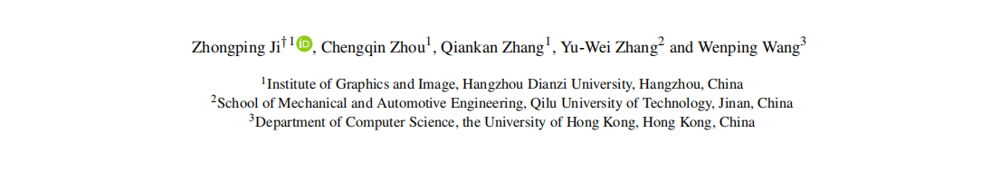
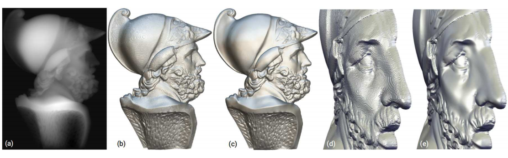
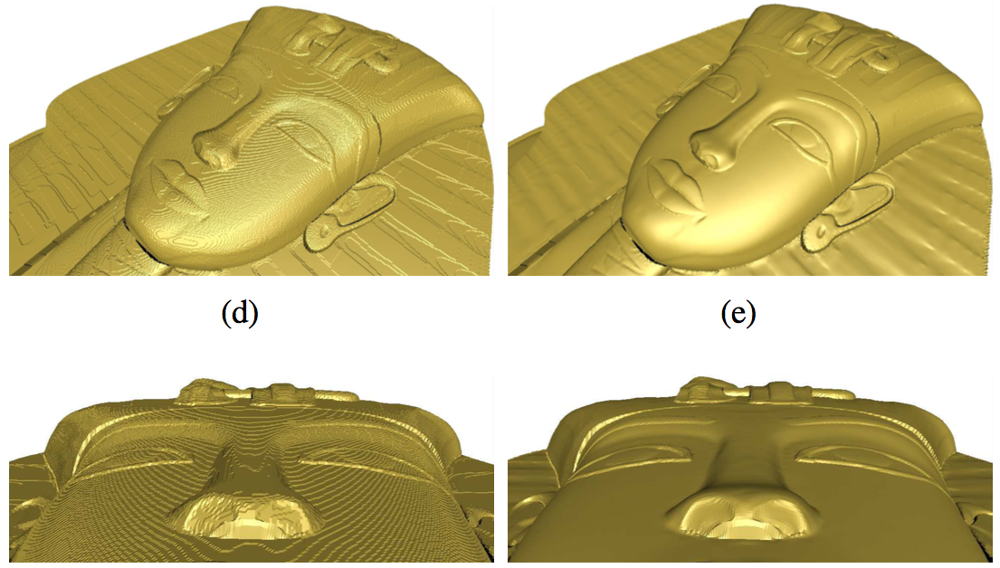
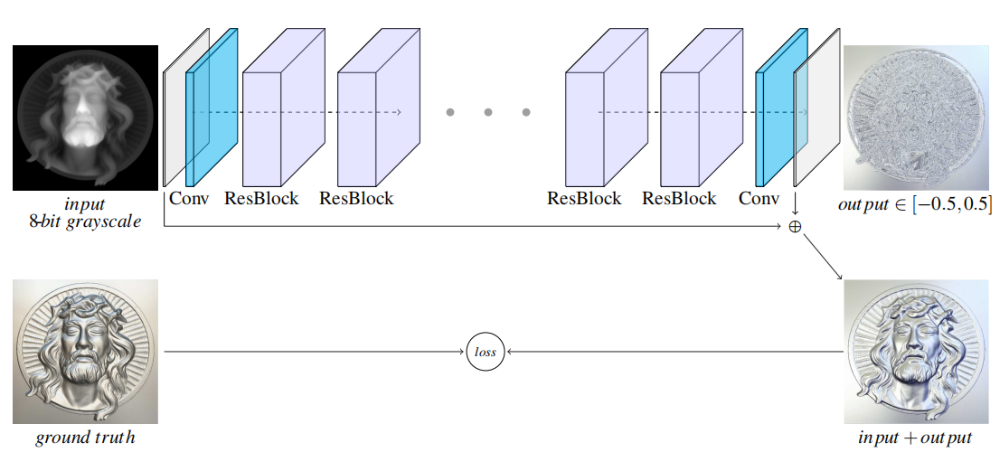
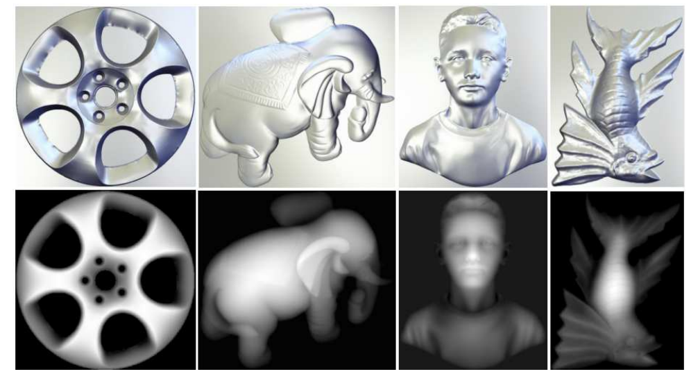

# A Deep Residual Network for Geometric Decontouring



## Introduction



Figure 1: Geometric Decontouring for grayscale image. (a) An input grayscale. (b) Convert (a) to a 3D mesh. Note that the false contours arise. (c) Our network eliminates the false contours and preserves the fine details well. (d-e) Close-ups of (b) and (c).

An example,



For details, please refer to our paper [A Deep Residual Network for Geometric Decontouring](./assets/GDCNet_PG2020.pdf).

## Architecture



Figure 2: Architecture of our network for geometric detail restoration from an 8-bit grayscale image. Our network consists of two convolutional layers and several residual blocks. The gray dots indicate repetition of the residual blocks. The output of our network is the predicted residual errors.

## Method

In this paper, we formulate the geometric decontouring as a constrained optimization problem from a geometric perspective.
Because the surface shading is more sensitive to normal vectors than height values, 
we define the optimization objective based on the local orientation of a surface. 
Therefore, given a grayscale image $h_g(u,v)$, we intend to remove the false contours by minimizing the reconstruction error between the original normals $\mathbf{n}(h_o(u,v))$ and the reconstructed normals $\mathbf{n}(h_g(u,v)+ r(u,v))$ under the constraints of rounding error bounds,

$$
\begin{equation}
\begin{split}
\min_{r(u,v)} &\left \|\mathbf{n}(h_g(u,v)+r(u,v))-\mathbf{n}(h_o(u,v))\right \|_2^2 \\
&s.t. \qquad r(u,v) \leq 0.5.\\
&  \qquad \quad \;\;\! r(u,v) \geq -0.5.
\end{split}
\end{equation}
$$

If the original normals $\mathbf{n}(h_o(u,v))$ are known, 
we can approximate the underlying height map by solving the above constrained optimization problem.
Unfortunately, $\mathbf{n}(h_o(u,v))$ is unknown.
Without prior knowledges about rounding errors, 
we seek an alternative solution based on machine learning.
Given a training dataset (pairs of $h_o(u,v)$ and $h_g(u,v)$),
we can design and train a neural network $\Phi{(h_g(u,v))}$ to predict the residual error $r(u,v)$, by minimizing the total reconstructed normal errors over a training set,

$$
\begin{equation}
\min_{\Phi} \sum_i \begin{Vmatrix}
\mathbf{n}(h_g^i(u,v)+\Phi{(h_g^i(u,v))}) - \mathbf{n}(h_o^i(u,v)) \end{Vmatrix}_2^2.
\end{equation}
$$

To this end, we design a neural network equiped with an activation function to make $\Phi{(h_g(u,v))}$ satisfy the constraints: $-0.5 \leq \Phi{(h_g(u,v))} \leq 0.5$.

To predict the rounding errors, our GDCNet naturally adopts a residual learning scheme.
Specifically, our network is trained to learn a residual mapping function $\Phi{(h_g(u,v))}$, whose range is $[-0.5,0.5]$, to approximate the rounding errors. To solve this problem, we have experimented with many network architectures and we finally design a simple but effective architecture. Figure. \ref{fig:network} shows the architecture of the proposed GDCNet. 

Our GDCNet takes as input an 8-bit grayscale image $h_g(u,v)$, and outputs a height map $\Phi{(h_g(u,v))}$. The $h_g(u,v)$ represents a quantified height map with discrete height values and the estimated rounding errors $\Phi{(h_g(u,v))}$ are scalars represented by floating point numbers. Then we reconstruct the height map $\hat{h}(u,v) = h_g(u,v) + \Phi{(h_g(u,v))}$ to approximate the underlying surface.  Finally, due to the rounding errors belong to the interval $[-0.5,0.5]$, we set the last activation function of our network as $\frac{1}{2}tanh(x)$ which guarantees the outputs of network $\Phi(h_g(u,v)) \in [-0.5,0.5]$.

### Loss functions

The primary task of our network is to restore the lost details introduced by the rounding errors. An 8-bit grayscale image here is actually a height map which can be viewed as a 2-manifold surface, and the local orientation of a surface plays an important role in the amount of light it reflects. This orientation at any point $p$ on the surface can be represented by a normal vector which is perpendicular to the surface at $p$. Specifically, for a height field $z=f(x,y)$, the normal at point $p=(x_0, y_0, z_0)$ can be expressed by

$$
\begin{equation}
\mathbf{n}(f,p)=\frac{1}{\sqrt{1+f_{x_0}^2+f_{y_0}^2}}\begin{bmatrix}
-f_{x_0}, -f_{y_0}, 1
\end{bmatrix}^T,
\end{equation}
$$

where, the derivatives are discretely approximated with the forward difference over the nearest neighboring pixels. Given a set of height pairs, we learn the parameters of network $\Phi{(\cdot)}$ by minimizing the reconstruction errors based on normal vectors. Specifically, the squared errors of normal vectors for a pair $(h_o(u,v),h_g(u,v))$ are defined as

$$
\begin{equation}
\begin{aligned}
\mathcal{L} =& \sum_{(u,v) \in \Omega}\begin{Vmatrix}
\mathbf{n}(h_o(u,v)) - \mathbf{n}(h_g(u,v)+\Phi{(h_g(u,v))}) \end{Vmatrix}_2^2 \\ =&
\sum_{(u,v) \in \Omega}
\begin{Vmatrix}
\mathbf{n}(h_o(u,v)) - \mathbf{n}(\phi(u,v)) 
\end{Vmatrix}_2^2,
\end{aligned}
\end{equation}
$$

where, $\Omega$ indicates the definition domain in $\mathbb{R}^2$, $\Phi(h_g)$ and $\phi=h_g+\Phi(h_g)$ are the prediction of our network and the reconstructed height map respectively. 

Driven by this loss function, our network is trained to repair the normal vector through the local region of each pixel in the grayscale image, thereby indirectly repairing the height map.

## Dataset



Figure 3: Some samples of our Height-Grayscale Dataset. The images shown in the top row are height maps, and the images in the bottom row are grayscales. A height map encodes the geometric details, so here we render it as a surface.

- The structure tree of the dataset:
  
  ```bash
  ./Height-Grayscale-Dataset
  ├── .
  ├── gray
  ├── └── 0.png
  ├──  ...
  ├──
  ├── height
  ├── └── 0.mat
  ├──  ...
  ├──
  ├── mask
  ├── └── 0.png
  ├──  ...  
  ```


#### The dataset can be downloaded [here](https://drive.google.com/file/d/1iJMFjMDVSZ9sHRI6yvFQwFcDvYKllno1/view?usp=sharing).


## Citation

If you find our work or Dataset useful to your research, please consider citing:


```bash
@article {pg2020GDCNet,
journal = {Computer Graphics Forum},
title = {A Deep Residual Network for Geometric Decontouring},
author = {Ji, Zhongping and Zhou, Chengqin and Zhang, Qiankan and Zhang, Yu-Wei and Wang, Wenping},
volume = {39},
number = {7},
pages = {27--41},
year = {2020},
publisher = {The Eurographics Association and John Wiley & Sons Ltd.},
ISSN = {1467-8659},
DOI = {10.1111/cgf.14124}
}
```
